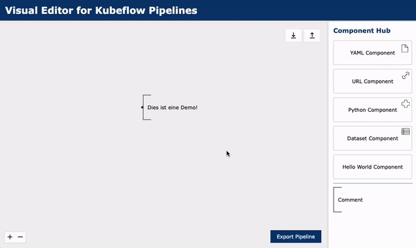
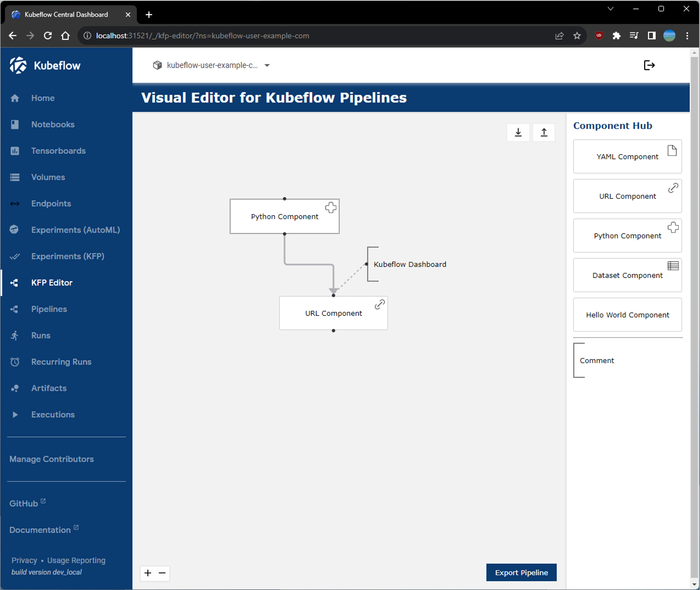

> [!WARNING] 
> Please note that this project is not intended for production use.  
> Expect potential bugs and incomplete features as this is an experimental prototype for the purpose of academic research.

<!-- PROJECT LOGO -->
<br />
<div align="center">
  <a href="https://github.com/nicjes/kfp-editor">
    
  </a>

<h3 align="center">Kubeflow Pipelines Visual Editor</h3>
  <p align="center">
    A low-code editor that facilitates the construction of ML pipelines for Kubeflow
    <br \>
    and promotes the idea of reusable components.
  </p>
   <br \>
   
   <br \>
</div>


<!-- ABOUT THE PROJECT -->
## About The Project


### Key Features

* **Beginner-friendly**: Place and connect ML components on a drag-and-drop interface
* **Component Hub**: Import existing components from YAML files or write advanced components using Python
* **Save/Restore**: Save, restore, share, and edit created pipelines
* **Kubeflow integration**: Export a YAML specification to run the pipeline in Kubeflow
* **Future-proof:** Cross-compatible for KFP v1.x and v2


### Built With

[![ReactFlow][ReactFlow]][ReactFlow-url]


<!-- GETTING STARTED -->
## Getting Started

You can either install and run a local copy (e.g. for development) or containerize the app by following these simple steps.


### Prerequisites

*Local Installation:*
[npm](https://www.npmjs.com/),
[Python](https://www.python.org/)

*Containerization:*
[Rancher Desktop](https://rancherdesktop.io/) (with Kubernetes enabled)


### Local Installation

1. Clone the repository
   ```sh
   git clone https://github.com/nicjes/kfp-editor.git
   ```

2. Install NPM packages
   ```sh
   npm install --prefix client/node_modules client
   npm install --prefix server/node_modules server
   ```

3. Run Frontend (new shell)

   _Development Mode_
   ```sh
   npm run dev --prefix client
   ```
   _Production Mode_
   ```sh
   npm run build --prefix client
   npm run preview --prefix client
   ```

3. Run Backend (new shell)

   _Development Mode_
   ```sh
   npm run dev --prefix server
   ```
   _Production Mode_
   ```sh
   npm run start --prefix server
   ```


### Containerization

This repository comes with a `Dockerfile` for easier deployment.

1. Clone the repository (if not already done)
   ```sh
   git clone https://github.com/nicjes/kfp-editor.git
   ```

2. Build Image
   ```sh
   docker build -t kfp-editor .
   ```

3. Run Container
   ```sh
   docker run -p 4173:4173 kfp-editor .
   ```


<!-- USAGE EXAMPLES -->
## Basic usage example

1. When opening up the editor you will see an empty canvas and the Component Hub on the right
2. Start by dragging a component from the Hub onto the canvas
3. Double-click the component to view and edit its arguments
4. Connect components by dragging an arrow from the bottom of the parent to the top of the child
5. Choose the desired values which were inherited from its parents
6. Save your first pipeline as a JSON file
7. Export a YAML file to run your pipeline within Kubeflow


<!-- INTEGRATION -->
## Kubeflow Integration
It is also possible to deploy the containerized application on Kubernetes and extend the Kubeflow Dashboard Config for tighter integration.




<!-- CONTRIBUTING -->
## Contributing

If you have a suggestion that would make this better, please fork the repo and create a pull request or simply open an issue. 

Any contributions you make to this open-source project are **greatly appreciated**.


<!-- LICENSE -->
## License

Distributed under the MIT License. See `LICENSE` for more information.


<!-- MARKDOWN LINKS & IMAGES -->
[ReactFlow]: https://img.shields.io/badge/React%20Flow-ff0072?style=for-the-badge&logo=react&logoColor=fff
[ReactFlow-url]: https://reactflow.dev/
